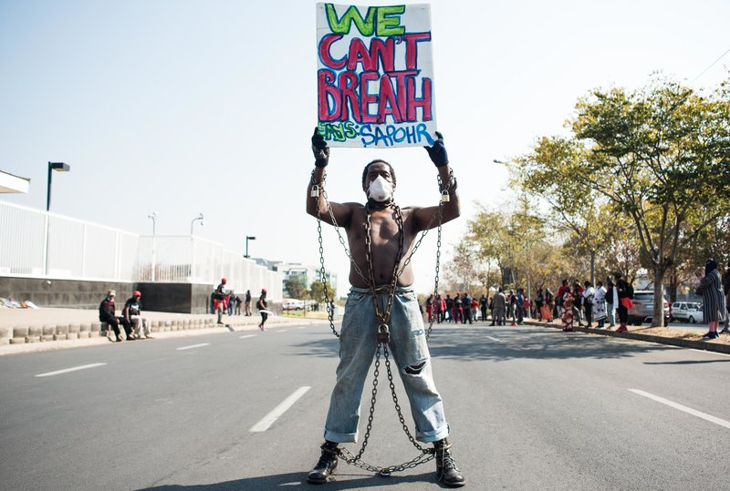

# Assignment 1: Protests
This repository contains code and analysis of protests in the United States, using data from [CountLove](https://countlove.org/).

---
## Protests in Context

- [_Black Lives Matter May Be The Largest Movement in U.S. History_](https://www.nytimes.com/interactive/2020/07/03/us/george-floyd-protests-crowd-size.html)   According to crowd-counting experts and scholars from across the country, the protest participation data that was collected over the summer of 2020 would suggest that it is the largest civil rights movement in the history of the United States. By the time that this article was written on July 3rd, there had already been nearly 5,000 demonstrations in 2,500 towns and cities across the U.S., with attendance ranging from dozens to tens of thousands.

- [_93% of Black Lives Matters Protests Have Been Peaceful_](https://time.com/5886348/report-peaceful-protests/)   The Armed Conflict Location & Event Data Project (ACLED), a non-profit organization that researches political violence and protests across the world, analyzed more than 7,750 Black Lives Matter demonstrations and found that the vast majority of BLM protests had been peaceful. The report highlights the disconnect between the publics perceived violence of BLM protestors and the reality of the peaceful demonstrations.

- [_In 2020, Protests Spread Across The Globe With A Similar Message: Black Lives Matter_](https://www.npr.org/2020/12/30/950053607/in-2020-protests-spread-across-the-globe-with-a-similar-message-black-lives-matt)   The BLM protests in the U.S. served as a catalyst for world wide demonstrations against policing culture and the mistreatment of minority groups across the world. This article puts into perspective how the killing of George Floyd and the protests that ensued thereafter ignited a world wide civil rights movement.

---

_Members of Economic Freedom Fighters (EFF) protest against the death of George Floyd outside U.S. Consulate in solidarity with Black Lives Matter movement on June 8, 2020 in Sandton, South Africa. (Gallo Images via Getty Images)_

The above image is from the article in the previous section titled _"In 2020, Protests Spread Across The Globe With A Similar Message: Black Lives Matter"_. This image powerfully envokes thoughts of slavery and how deeply our societies issues are tied to the sins of our past, and how those racist and discriminatory ideals still persist in modern times. It also captures the global scale of the social justice movement that captured the world over the summer of 2020.

---
## Analysis Reflections

- **Q: What does the difference between the mean and the median attendee counts tell you about the *distribution* of the data?**  
A: With the median being 100 attendees and the mean being ~650 attendees, this implies that the data set is very top heavy due to a few outliers in the data set. There are most likely some very large demonstrations with high attendance counts that are influencing the average (mean) of the data, while the majority of demonstrations had lower attendance counts closer to the median.

- **Q: Does the number of protests in Washington surprise you? Why or why not?**  
A: Seeing that 1,369 protests took place in Washington doesn't surprise me because I was able to take place in a lot of the marches that occurred over the summer and I was very aware of just how many marches and demonstrations were being organized across the state. It was incredible to see just how many people were willing to mobilize and take place in the BLM movement and being present for some of those moments was a very impactful life experience.

- **Q: Looking at your state counts, what data quality issues do you
notice? What would you have to do to "fix" these issues?**  
A: It seems that there were some entry inaccuracies with certain states not being correctly capitalized ("Wa" instead of "WA") and also some locations that were not states whatsoever ("Mexico", "Department", "Space", etc.). To clean up this data I would need to somehow filter out any entries that did not match the correct formatting of states (two capitalized letters) and preferably group the ones such as "Wa" and "Mi" with the other entries that are properly capitalized and clearly from the same state.

- **Q: Does the change in the number of protests from 2019 to 2020 surprise you? Why or why not?**  
A: It is striking to see that it more than doubled from 2019 to 2020, but I am not surprised to see a significant increase. I believe the public had a heightened awareness of the injustices that were taking place due to everyone being at home and on their phones while on COVID lockdown, and it was also very difficult to stomach some of the events that were taking place because it truly made it seem like nothing had changed since the events in Ferguson, MI in 2014 when Michael Brown was killed by a police officer. As a result of the pandemic, people also had more time on their hands and I believe that the melting pot of circumstances led to a massive increase in activism over the year of 2020.

- **Q: Find at least 2 specific policy changes that came as a result of the protests in 2020**  

  - [_Austin City Council cuts police department budget by one-third, mainly through reorganizing some duties out from law enforcement oversight_](https://www.texastribune.org/2020/08/13/austin-city-council-cut-police-budget-defund/)  
  One of the swiftest responses to the call across America to "Defund the Police" came from the Austin, TX City Council who voted in August to defund their police department by $150 million and realocate those funds to social services such as violence prevention, food access and abortion access programs.  

  - [New York Gov. Andrew Cuomo Signs Police Reform Package, Outlaws Chokeholds & False Race-Based 911 Calls](https://deadline.com/2020/06/andrew-cuomo-police-reform-chokehold-law-george-floyd-1202957801/)  
  The most common policy change that occurred across the U.S. following the murder of George Floyd was the outlawing of chokeholds, and New York was one of the first cities to sign such legislation. Also, 9-1-1 calls that are made purely based upon racially charged motives were outlawed in that reform package after several videos had gone viral over the summer of "Karens" (a term that has come to define racist white women) calling the police on law abiding people of color for no apparent reason other than to abuse their own privilege and exploit the systemic racism that they have been lifted up by to their own advantage.  

  - [Seattle City Council bans police use of tear gas and chokeholds as protests for Black lives continue](https://www.seattletimes.com/seattle-news/politics/seattle-city-council-bans-police-use-of-tear-gas-and-chokeholds-as-protests-for-black-lives-continue/?utm_source=marketingcloud&utm_medium=email&utm_campaign=BNA_061620043236+Seattle+City+Council+bans+chokeholds%2c+tear+gas+use_6_15_2020&utm_term=Active%20subscriber)  
  The Seattle City Council banned chokeholds and police use of tear gas and other chemical irritants that had been used on protesters in downtown Seattle. Strangely enough, I was protesting in Seattle the day after Mayor Jenny Durken issued a 30-day ban on chemical irritants, and the police used chemical irritants on us that day and the [ACLU of Washington filed a lawsuit](https://www.aclu.org/press-releases/aclu-blm-seek-emergency-court-order-barring-use-chemical-weapons-protesters-seattle) against the police department for doing so.

- **Q: Inspect the `high_level_purpose_table`, what does this tell you about the current climate in the U.S.?**  
A: While there are a wide range of topics contained in the high level purposes table, the one with easily the most occurrences is "Racial Injustice". I think this puts into perspective just how focused the American people are on the current issues of police brutality, systemic racism, and the myriad of racial injustices that are present in our current society. These injustices have been brought to the forefront of our minds by the repeated killings of innocent people of color by the hands of the police. This is not a new issue in America, or the world at large, but it has found new ground in the consciousness of the American people.

  ---

## Conclusions

- **What results from the analysis surprised you? Why?**  

  - Seeing some of the protest numbers and frequencies quantified was really surprising. I knew that there had been a massive movement across the country, but actually seeing how many unique cities in which they took place and how many demonstrations occurred on those same days in May was really cool.

- **What parts of the analysis did you find most challenging?**  

  - The most challenging part of the analysis for me was the manipulation of the strings inside of the cells, particularly when attempting to extract the `high_level_purposes`. I hadn't practiced or had any experience doing something like that up until this point so it required a good bit of digging and I'm still feeling a bit fuzzy about how `regex`, `gsub`, and escape syntax works.

- **What kind of analysis do you wish you were able to do with the dataset (but perhaps don't have the technical skills to do so)?**  

  - It would be interesting to see how some of the information relates like what was the average turnout for each of the high level purposes, when was each high level purpose occurring most often, or maybe look for trends in the data like how long did each high level purpose stay trending at it's highest point of frequency and how long on average they sort of "last" before losing steam.
